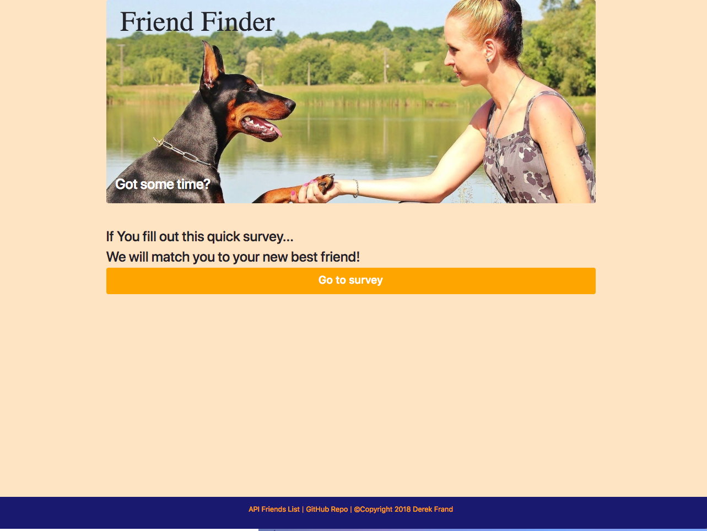

# FriendFinder
A fullstack application that takes in the input from a 10 question survey and matches You with your new Best Friend.  

 

 

 ***
## Getting Started

 - Clone repo.
 - Run 'npm install' in command line.
 - Run 'node index.js' to get started playing the game.

***
## Technologies Used:

 * Node.js
 * Express.js
 * Bootstrap
 * HTML5
 * CSS3

***
##  Installs

### Express
 - `npm install express`
 
### Path
 - `npm install path`
 
### Body-parser
 - `npm install body-parser`

***
## Contributors: 

 - Derek Frand [GitHub](https://github.com/Dfrand)
 